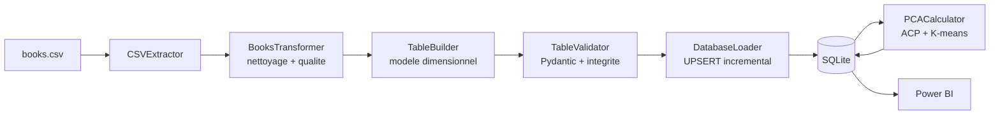
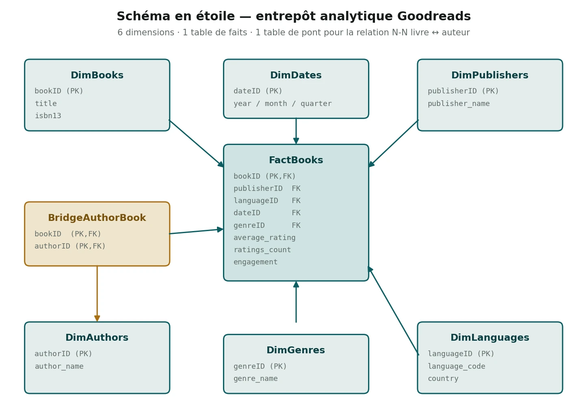
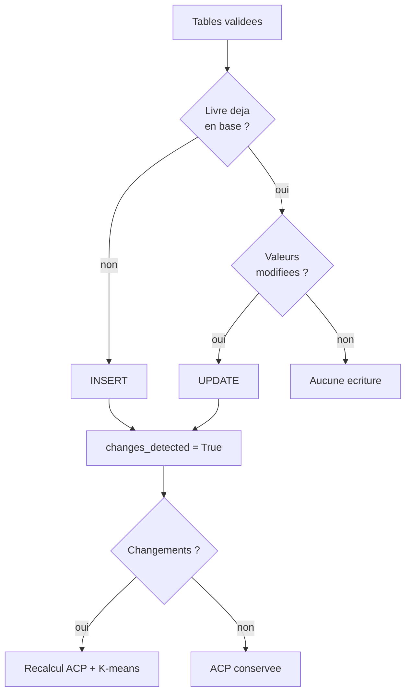

# Architecture et spécifications techniques

Ce document décrit la chaîne ETL, le modèle dimensionnel, la stratégie de
chargement incrémental et l'enrichissement analytique.

---

## 1. Vue d'ensemble



Chaque responsabilité vit dans son module, orchestrée par `main.py` :

| Étape | Module | Responsabilité |
| --- | --- | --- |
| 1. Configuration | `src/utils/config_loader.py` | lecture YAML, résolution des chemins |
| 2. Extraction | `src/extract/csv_extractor.py` | lecture CSV, statistiques source, archivage horodaté |
| 3. Transformation | `src/transform/book_transformer.py` | typage, valeurs manquantes, doublons, valeurs aberrantes |
| 4. Modélisation | `src/transform/table_builder.py` | dimensions, faits, table de pont, métriques dérivées |
| 5. Validation | `src/validator/table_validator.py` | modèles Pydantic, intégrité référentielle |
| 6. Chargement | `src/load/db_loader.py` | UPSERT incrémental, détection de changement |
| 7. Enrichissement | `src/utils/pca_calculator.py` | ACP + K-means sur livres, auteurs, éditeurs |

Le pipeline complet s'exécute en **moins de 5 secondes** sur l'échantillon de
démonstration, et il est couvert par **278 tests**.

---

## 2. Modèle dimensionnel



### Pourquoi une étoile, et pas une table à plat

Un fichier plat oblige un outil BI à répéter le nom d'un éditeur sur chacun de ses
livres, et rend impossible le filtrage propre par langue ou par trimestre. Le
modèle en étoile sépare les **mesures** (table de faits) des **axes d'analyse**
(dimensions) : Power BI construit ses filtres sur les dimensions et agrège les
faits.

| Table | Nature | Rôle |
| --- | --- | --- |
| `FactBooks` | faits | une ligne par livre, avec les mesures et les clés étrangères |
| `DimBooks` | dimension | identité du livre : titre, ISBN |
| `DimAuthors` | dimension | auteurs uniques |
| `DimPublishers` | dimension | éditeurs uniques |
| `DimLanguages` | dimension | code langue, libellé, pays |
| `DimDates` | dimension | calendrier : année, mois, trimestre, nom du jour |
| `DimGenres` | dimension | genres retenus |
| `BridgeAuthorBook` | pont | relation N-N entre livres et auteurs |

### La table de pont

Un livre peut avoir plusieurs auteurs, un auteur écrit plusieurs livres. Placer
`authorID` dans `FactBooks` imposerait de choisir un auteur principal et perdrait
les coauteurs. `BridgeAuthorBook` porte la relation, avec une clé primaire
composite `(bookID, authorID)` qui interdit structurellement les doublons.

### Intégrité et performance

Toutes les clés étrangères sont déclarées avec leur comportement de suppression
(`ON DELETE CASCADE` pour les faits, `SET NULL` pour les dimensions), et
`PRAGMA foreign_keys = ON` est activé à l'ouverture — SQLite ne l'applique pas par
défaut.

Dix index sont créés sur les clés étrangères de la table de faits, la table de pont
et les attributs calendaires.

> **Un défaut corrigé.** `create_indexes()` était défini et couvert par cinq tests
> unitaires, mais **n'était jamais appelé par le pipeline** : aucun des dix index
> déclarés n'existait dans la base produite. C'est un bon rappel qu'une méthode
> testée n'est pas une méthode utilisée.

---

## 3. Qualité des données

`BooksTransformer` applique les contrôles dans un ordre qui compte : on ne
déduplique qu'après normalisation, sinon deux graphies d'un même titre échappent à
la détection.

| Contrôle | Traitement |
| --- | --- |
| Colonnes requises | échec explicite si une colonne manque |
| Identifiants corrompus | lignes écartées |
| Typage | conversion explicite, pas d'inférence pandas |
| Valeurs manquantes | valeurs par défaut définies dans `config.yaml` |
| Normalisation texte | espaces, casse, caractères parasites |
| Doublons | suppression après normalisation |
| Valeurs aberrantes | notes ramenées dans l'intervalle `[0, 5]` |

### Vérifiable sur l'échantillon

Le générateur `scripts/generate_sample_data.py` injecte volontairement six défauts.
La trace d'exécution montre le pipeline les traiter :

```
Fichier lu : 301 lignes, 12 colonnes
genre_name: valeurs invalides/NA remplacées par 'Other'
average_rating: 1 valeurs corrigées [0-5]
1 paires de doublons supprimées
Transformation terminée : 300 lignes (1 supprimées, 0.3%)
Aucune valeur manquante
```

C'est délibéré : un échantillon parfaitement propre ne démontrerait rien des
contrôles.

### Validation avant chargement

`TableValidator` applique des modèles **Pydantic** table par table, puis vérifie
l'intégrité référentielle : chaque clé étrangère de `FactBooks` et de
`BridgeAuthorBook` doit exister dans sa dimension. Une violation interrompt le
pipeline **avant** écriture — la base ne peut pas se retrouver dans un état
incohérent.

---

## 4. Chargement incrémental

Recharger intégralement l'entrepôt à chaque exécution serait simple mais coûteux,
et détruirait les horodatages `created_at`.



| Table | Stratégie |
| --- | --- |
| `DimBooks` | UPSERT : insertion des nouveaux, mise à jour des modifiés |
| Autres dimensions | insertion des seules valeurs absentes |
| `FactBooks` | UPSERT sur `bookID` |
| `BridgeAuthorBook` | synchronisation depuis la source |
| Tables ACP | recalculées **uniquement** si un changement a été détecté |

Le drapeau `changes_detected` évite de refaire une ACP et un K-means complets quand
rien n'a bougé — sur un pipeline planifié quotidiennement, c'est l'essentiel du
temps de calcul économisé.

Toutes les requêtes utilisent `executemany` avec des paramètres liés ; aucune valeur
n'est concaténée dans une requête SQL.

---

## 5. Métrique dérivée : l'engagement

```
engagement = text_reviews_count / ratings_count
```

Le ratio distingue un livre **noté** d'un livre **discuté**. Deux titres à 10 000
notes ne se valent pas si l'un suscite 50 commentaires et l'autre 2 000.

C'est une mesure d'**association**, pas de causalité : rien ne permet d'affirmer que
la discussion cause la visibilité, ni l'inverse.

---

## 6. Enrichissement ACP + K-means

`PCACalculator` produit trois tables d'enrichissement — `BookPCA`, `AuthorPCA`,
`PublisherPCA` — obtenues par :

1. agrégation des mesures au niveau de l'entité (livre, auteur ou éditeur) ;
2. transformation logarithmique des variables très asymétriques (`ratings_count`) ;
3. standardisation ;
4. ACP à deux composantes ;
5. K-means sur ces composantes ;
6. attribution d'un libellé descriptif par cluster, ordonné selon une métrique de
   classement.

### Précautions prises

Le code traite explicitement les cas dégénérés — un seul individu, colonne
constante, moins d'individus que de clusters demandés — plutôt que de laisser
scikit-learn lever une exception en production.

### Limite méthodologique

Les clusters sont des **segments descriptifs**, pas des classes de vérité terrain.
Ils résument une structure observée dans les données ; ils ne prédisent rien et ne
doivent pas être présentés comme des catégories validées.

Le nombre de clusters est une constante de configuration, **non justifiée par un
critère** (coude ou silhouette). C'est une amélioration identifiée.

---

## 7. Configuration et exploitation

Tout le comportement est centralisé dans `config/config.yaml` : chemins, options
CSV, schémas SQL des tables et des index, valeurs par défaut, genres autorisés,
taille de lot, politique de réessai, archivage de la source.

Le schéma des tables vit donc **dans la configuration**, pas dans le code Python.
Ajouter une dimension ne demande pas de modifier `db_loader.py`.

`scheduler/setup.ps1` enregistre une tâche quotidienne dans le Planificateur de
tâches Windows, qui exécute `run.bat` : activation de l'environnement virtuel,
lancement du pipeline, écriture d'un état dans `logs/`.

---

## 8. Limites connues

- **Le nombre de clusters n'est pas justifié** par un critère quantitatif.
- **L'orchestration est spécifique à Windows.** Un DAG (Prefect, Airflow) ou un
  simple cron rendraient le projet portable et parleraient davantage
  « data engineering ».
- **La couverture n'est pas contrôlée en intégration continue** : le workflow
  calcule la couverture mais n'impose aucun seuil, et n'exécute pas de linter.
- **Commentaires en français, README en anglais à l'origine** — hérité, en cours
  d'uniformisation.
- **Aucun test d'intégration de bout en bout** : les 278 tests sont unitaires. Le
  générateur d'échantillon rend pourtant un tel test facile à écrire.
