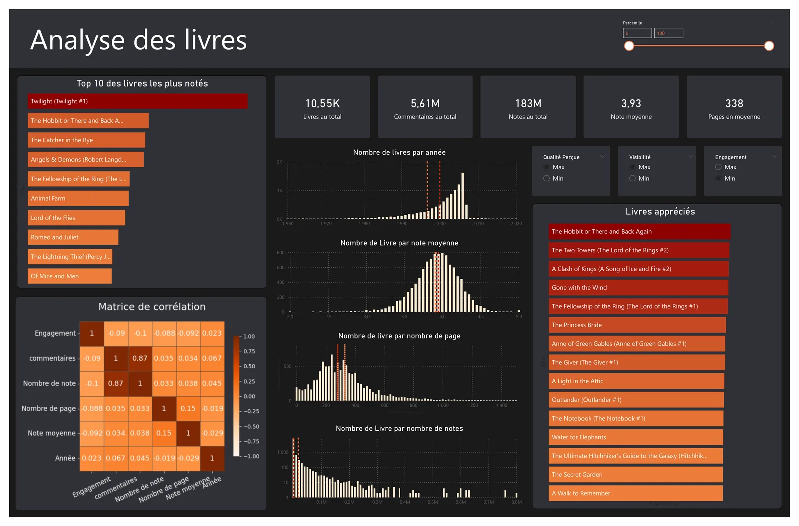
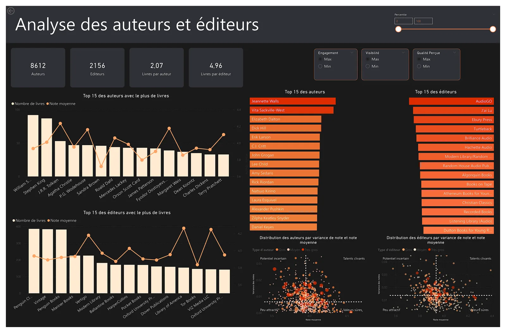
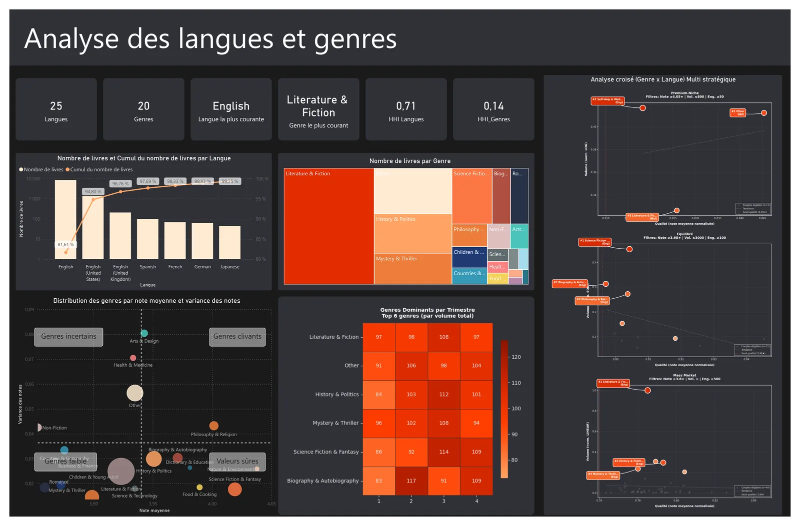
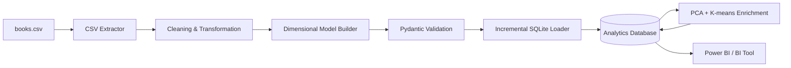
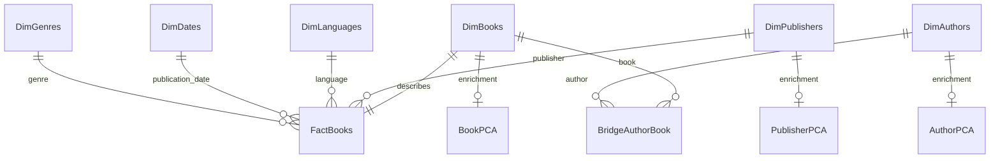

# Goodreads Analytics ETL Pipeline

[](https://github.com/juleescourne/goodreads-analytics-etl/actions/workflows/tests.yml)


[](LICENSE)

A production-style **Python ETL pipeline** that transforms raw book data into a validated **SQLite analytical warehouse** designed for BI exploration. The project combines data cleaning, dimensional modeling, incremental loading, data-quality checks, PCA/K-means enrichment, automated scheduling, and a comprehensive test suite.

> **Walkthrough with the Power BI dashboards:**
> [juleescourne.github.io/portfolio-data-analyst/#/goodreads](https://juleescourne.github.io/portfolio-data-analyst/#/goodreads)

## Run it in one minute

The real dataset is not redistributed here, so the repository ships a generator that
produces a structurally identical synthetic sample — including deliberate duplicates,
missing values and out-of-range ratings, so the cleaning and validation stages have
something to do:

```bash
pip install -r requirements.txt
python scripts/generate_sample_data.py     # writes data/raw/books.csv
python main.py                             # builds the analytical database
```

The pipeline completes in about 5 seconds and produces:

| Table | Rows (sample run) |
| --- | ---: |
| `DimBooks` | 300 |
| `DimAuthors` | 96 |
| `DimDates` | 296 |
| `DimGenres` | 7 |
| `DimLanguages` | 6 |
| `DimPublishers` | 6 |
| `FactBooks` | 300 |
| `BridgeAuthorBook` | 372 |
| `BookPCA` / `AuthorPCA` / `PublisherPCA` | 299 / 92 / 6 |

plus the 10 declared indexes, with referential-integrity checks passing.
Numbers above come from the synthetic sample and carry no analytical meaning —
they exist to show the pipeline runs end to end.

## What this project demonstrates

- End-to-end **Extract → Transform → Load** orchestration in Python
- Data cleaning and quality control with pandas
- **Star-schema / dimensional modeling** for analytical workloads
- Many-to-many modeling through an author/book bridge table
- Pydantic-based row validation and referential-integrity checks
- Incremental SQLite loading with **UPSERT** logic
- Derived analytical metrics for BI reporting
- **PCA + K-means** enrichment for books, authors, and publishers
- Structured logging, retry handling, source archiving, and Windows scheduling
- Automated testing with **278 pytest tests**

## BI output

The analytical database is consumed in Power BI. Three report pages cover the catalogue,
the authors/publishers, and the genres/languages.

| | |
| --- | --- |
|  |  |



## Pipeline architecture



The pipeline is orchestrated by `main.py` and each responsibility is isolated in a dedicated module under `src/`.

## Analytical data model

The warehouse separates descriptive dimensions from book-level metrics.



### Main tables

| Table | Purpose |
| --- | --- |
| `DimBooks` | Book identity and title information |
| `DimAuthors` | Unique authors |
| `DimPublishers` | Publishers |
| `DimLanguages` | Language metadata |
| `DimDates` | Calendar attributes for publication dates |
| `DimGenres` | Book genres |
| `FactBooks` | Ratings, reviews, page counts, engagement and foreign keys |
| `BridgeAuthorBook` | Many-to-many relationship between books and authors |
| `BookPCA` | PCA coordinates and cluster assignment for books |
| `AuthorPCA` | PCA coordinates and cluster assignment for authors |
| `PublisherPCA` | PCA coordinates and cluster assignment for publishers |

## ETL stages

### 1. Extract

`CSVExtractor` reads `data/raw/books.csv`, applies the configured CSV options, reports source statistics, and can archive the source file with a timestamp.

### 2. Transform

`BooksTransformer` performs the main data-quality operations:

- required-column validation;
- corrupted identifier filtering;
- explicit type conversion;
- missing-value handling;
- text normalization;
- duplicate removal;
- outlier handling.

### 3. Build the analytical model

`TableBuilder` turns the cleaned flat dataset into dimensions, facts and the author/book bridge table. It also derives analytical fields such as:

```text
engagement = text_reviews_count / ratings_count
```

### 4. Validate

`TableValidator` applies Pydantic models and verifies key constraints before loading. Referential-integrity checks cover both the fact table and the author/book bridge.

### 5. Incremental load

`DatabaseLoader` writes to SQLite while avoiding unnecessary full reloads:

- new books are inserted;
- modified books are updated;
- dimension records are inserted incrementally;
- author/book relationships are synchronized;
- PCA enrichment is recalculated only when data changes are detected.

### 6. Analytical enrichment

`PCACalculator` aggregates and prepares numerical features, applies scaling/log transformations where relevant, computes two PCA components and performs K-means clustering.

The implementation also handles small or constant datasets explicitly so degenerate inputs do not crash the analytical stage.

## Tech stack

**Data & analytics**

- Python
- pandas
- NumPy
- scikit-learn
- Pydantic

**Storage & modeling**

- SQLite
- Star schema / dimensional modeling
- Incremental SQL loading

**Engineering**

- YAML configuration
- Python logging
- pytest / pytest-cov
- GitHub Actions
- Windows Task Scheduler automation

**BI target**

- Power BI or any tool able to query SQLite exports / derived datasets

## Project structure

```text
.
├── main.py
├── config/
│   ├── config.yaml
│   └── logging_config.yaml
├── data/
│   ├── raw/
│   ├── processed/
│   ├── archive/
│   └── database/
├── scheduler/
│   ├── run.bat
│   └── setup.ps1
├── src/
│   ├── extract/
│   │   └── csv_extractor.py
│   ├── transform/
│   │   ├── book_transformer.py
│   │   └── table_builder.py
│   ├── validator/
│   │   └── table_validator.py
│   ├── load/
│   │   ├── database_connection.py
│   │   └── db_loader.py
│   └── utils/
│       ├── config_loader.py
│       └── pca_calculator.py
├── tests/
├── .github/workflows/tests.yml
├── requirements.txt
└── requirements-dev.txt
```

## Input schema

The dataset itself is not included in the repository. Place a compatible file at:

```text
data/raw/books.csv
```

Required columns:

```text
bookID
title
authors
average_rating
isbn13
language_code
num_pages
ratings_count
text_reviews_count
publication_date
publisher_name
genre_name
```

See [`data/README.md`](data/README.md) for details.

## Quick start

### 1. Clone and create a virtual environment

```bash
git clone <repository-url>
cd <repository-directory>
python -m venv .venv
```

On Windows:

```powershell
.venv\Scripts\activate
```

On Linux/macOS:

```bash
source .venv/bin/activate
```

### 2. Install dependencies

```bash
pip install -r requirements.txt
```

### 3. Add the source CSV

```text
data/raw/books.csv
```

### 4. Run the pipeline

```bash
python main.py
```

The analytical SQLite database is generated at:

```text
data/database/book_database.db
```

## Run the tests

Install development dependencies:

```bash
pip install -r requirements-dev.txt
```

Run the suite:

```bash
pytest
```

With coverage:

```bash
pytest --cov=src --cov-report=term-missing
```

The cleaned portfolio version passes **278 tests**. The source package reaches approximately **95% test coverage** in the local verification environment.

## Daily automation on Windows

The `scheduler/` directory contains scripts for Windows Task Scheduler.

To register a daily execution at midnight:

```powershell
cd scheduler
.\setup.ps1
```

The scheduled task runs `scheduler/run.bat`, activates a local virtual environment when present, executes the ETL, and writes scheduler status information to `logs/`.

## Configuration

Pipeline behavior is centralized in `config/config.yaml`, including:

- source and destination paths;
- CSV encoding and delimiter;
- SQLite table/index definitions;
- default values for missing data;
- supported genres;
- batch size;
- retry behavior;
- source archiving.

Logging behavior is configured separately in `config/logging_config.yaml`.

## Engineering notes

This repository intentionally does **not** track source CSV files, generated SQLite databases, logs, Power BI files, virtual environments or generated documentation. This keeps the Git history focused on code and avoids publishing local or potentially licensed data artifacts.

The PCA/K-means cluster labels are descriptive analytical segments, not supervised ground-truth classes. They should therefore be interpreted as exploratory BI enrichment rather than predictive labels.

## Author

**Jules Courné**  
Data Analyst / Data Engineer — Python, SQL, ETL, BI & Machine Learning
