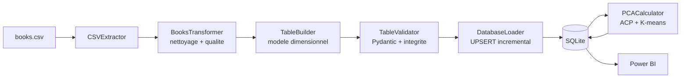

# Goodreads Analytics ETL

[](https://github.com/juleescourne/goodreads-analytics-etl/actions/workflows/tests.yml)


[](LICENSE)

Pipeline ETL Python qui transforme un catalogue de livres brut en **entrepôt
analytique en étoile**, prêt pour la BI : nettoyage, contrôles qualité, validation
Pydantic, chargement incrémental et enrichissement ACP.

> Parcours commenté avec les tableaux de bord Power BI —
> [juleescourne.github.io/portfolio-data-analyst/#/goodreads](https://juleescourne.github.io/portfolio-data-analyst/#/goodreads)


---

## Exécutable en une minute

Le dataset d'origine n'est pas redistribué. Le dépôt fournit un générateur qui
produit un CSV de structure identique — **défauts inclus**, pour que les contrôles
qualité aient quelque chose à faire :

```bash
pip install -r requirements.txt
python scripts/generate_sample_data.py     # écrit data/raw/books.csv
python main.py                             # construit l'entrepôt
```

Environ 5 secondes plus tard :

| Table | Lignes |
| --- | ---: |
| `DimBooks` | 300 |
| `DimAuthors` | 98 |
| `DimDates` | 295 |
| `DimGenres` | 7 |
| `DimLanguages` | 6 |
| `DimPublishers` | 6 |
| `FactBooks` | 300 |
| `BridgeAuthorBook` | 372 |
| `BookPCA` / `AuthorPCA` / `PublisherPCA` | 299 / 92 / 6 |

Plus les 10 index déclarés, contrôles d'intégrité référentielle passés. Ces chiffres
proviennent de l'échantillon synthétique et n'ont aucune portée analytique : ils
montrent que la chaîne tourne de bout en bout.

---

## Ce que le projet démontre

| Domaine | Éléments concrets |
| --- | --- |
| Modélisation dimensionnelle | 6 dimensions, 1 table de faits, table de pont pour la relation N-N livre ↔ auteur |
| Qualité des données | typage explicite, doublons, valeurs aberrantes, valeurs manquantes, validation Pydantic |
| Intégrité | clés étrangères déclarées, `PRAGMA foreign_keys` activé, contrôle référentiel **avant** écriture |
| Chargement incrémental | UPSERT, détection de changement, recalcul ACP conditionnel |
| Ingénierie | schémas SQL en configuration, journalisation structurée, 278 tests, intégration continue |

---

## La qualité des données, démontrée et non affirmée

Le générateur d'échantillon injecte volontairement six défauts. La trace
d'exécution montre le pipeline les traiter un à un :

```text
Fichier lu : 301 lignes, 12 colonnes
Statistiques : 301 lignes, 1 doublons
genre_name: valeurs invalides/NA remplacées par 'Other'
average_rating: 1 valeurs corrigées [0-5]
1 paires de doublons supprimées
Transformation terminée : 300 lignes (1 supprimées, 0.3%)
Aucune valeur manquante
```

Un échantillon parfaitement propre ne prouverait rien. Celui-ci contient une ligne
dupliquée, une note à 7,4 sur une échelle de 5, une date impossible (31 février), un
nombre de pages vide, une langue absente et un livre à zéro note — ce dernier pour
forcer la garde sur le calcul d'engagement.

---

## Architecture



Deux choix structurent le pipeline :

**La validation précède l'écriture.** L'intégrité référentielle est contrôlée sur
les DataFrames, avant tout `INSERT`. La base ne peut donc pas se retrouver dans un
état incohérent, même en cas d'échec au milieu du chargement.

**Le chargement est incrémental.** Un drapeau `changes_detected` évite de recalculer
l'ACP et le K-means quand la source n'a pas bougé — sur un pipeline planifié
quotidiennement, c'est l'essentiel du temps de calcul économisé.

Détail complet : [ARCHITECTURE.md](ARCHITECTURE.md).

---

## Restitution BI

L'entrepôt alimente trois pages Power BI : catalogue, auteurs et éditeurs, genres et
langues.

| | |
| --- | --- |
|  |  |


---

## Documentation

| Document | Contenu |
| --- | --- |
| [INSTALLATION.md](INSTALLATION.md) | prérequis, installation, configuration, automatisation, dépannage |
| [UTILISATION.md](UTILISATION.md) | exécution, lecture des journaux, requêtes SQL types, branchement Power BI |
| [ARCHITECTURE.md](ARCHITECTURE.md) | modèle dimensionnel, qualité, chargement incrémental, ACP |

---

## Stack

`Python 3.11+` · `pandas` · `NumPy` · `Pydantic` · `scikit-learn` · `SQLite`
· `PyYAML` · `pytest` · `GitHub Actions` · `Power BI`

Cinq dépendances d'exécution, toutes épinglées.

---

## Tests

```bash
pip install -r requirements-dev.txt
pytest
```

**278 tests unitaires**, exécutés à chaque push par GitHub Actions.

---

## Limites assumées

- **Le nombre de clusters K-means n'est pas justifié** par un critère quantitatif
  (coude, silhouette). Les segments sont descriptifs, jamais prédictifs.
- **L'orchestration est spécifique à Windows** (Planificateur de tâches). Un DAG ou
  un cron rendraient le projet portable.
- **La couverture n'est pas contrôlée en intégration continue** : elle est calculée,
  mais aucun seuil n'est imposé et aucun linter n'est exécuté.
- **Aucun test d'intégration de bout en bout** : les 278 tests sont unitaires.

Ces points, et un défaut corrigé — dix index déclarés qui n'étaient jamais créés —
sont détaillés dans [ARCHITECTURE.md](ARCHITECTURE.md#8-limites-connues).

---

## Licence

[MIT](LICENSE) — Jules Courné. Le jeu de données Goodreads n'est pas couvert par
cette licence et n'est pas redistribué.
