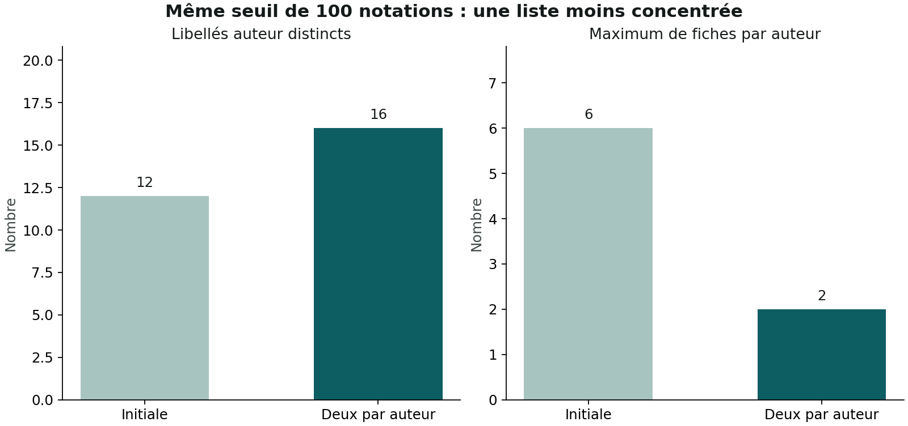
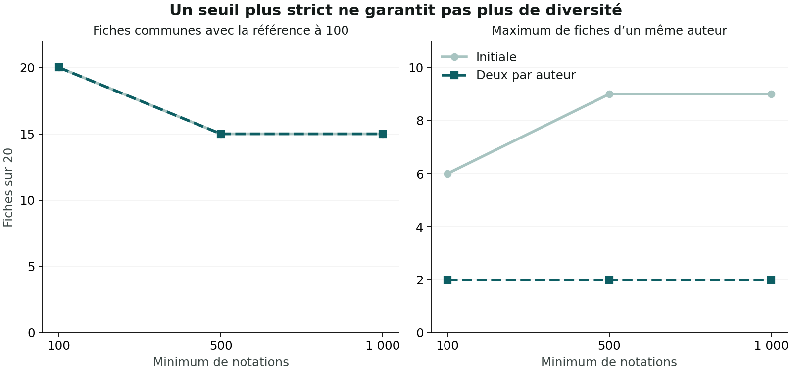

# Goodreads — Du catalogue à une sélection éditoriale argumentée

**Projet personnel de Data Analyst junior — Jules Courné**
Python · Pandas · Matplotlib · Power Query · Power BI · DAX

Pour la librairie fictive **Lire & Choisir**, je prépare une sélection de livres en français à partir d’un catalogue imparfait. Je contrôle les données, construis une première liste de 20 fiches, puis compare sa diversité et sa stabilité avant de proposer une règle éditoriale simple.

**[Explorer l’étude et les six listes](https://juleescourne.github.io/portfolio-data-analyst/#/goodreads)** · **[Lire la synthèse PDF](docs/livrables/Goodreads_synthese.pdf)** · **[Consulter les 20 propositions](docs/livrables/selection_francais.csv)**

## Ce que l’analyse apporte

- **Qualité :** 1 850 032 fiches conservées ; 112 répétitions retirées et 166 versions contradictoires isolées. La langue manque pour 86,40 % des fiches.
- **Sélection :** 16 327 fiches explicitement en français donnent 3 002 candidates et 2 716 groupes titre/auteur, avant sélection des 20 propositions.
- **Diversité :** limiter la sélection à deux fiches par libellé auteur fait passer la liste de **12 à 16 libellés distincts**. Quatre fiches changent ; la note moyenne passe de **4,646 à 4,642 / 5** (arrondie).
- **Stabilité :** passer de 100 à 500 notations remplace **5 fiches sur 20**, dans chaque règle. La liste initiale atteint alors **9 fiches pour un même auteur**, contre 6 au seuil 100. Un seuil plus strict ne suffit donc pas à diversifier la proposition.



**Recommandation :** retenir comme point de départ la variante à deux fiches maximum par libellé auteur et au moins 100 notations. Vérifier ensuite les séries, coffrets, éditions et disponibilités avant un test. Ce plafond est un choix éditorial discutable, pas un optimum statistique ni une promesse de ventes.

## Des règles explicables

1. Français renseigné, note exploitable ≥ 4/5, au moins 100 notations.
2. Auteur et éditeur présents, pagination positive et ≤ 5 000.
3. Une représentante par titre/auteur normalisé : plus grand nombre de notations, puis plus petit identifiant en cas d’égalité.
4. Classement par note, volume de notations puis identifiant.
5. Pour la proposition, maximum deux fiches par **libellé auteur normalisé**, puis les 20 premières. Les contributeurs ne sont pas séparés et les séries restent à relire.

Les six listes sont recalculées : règle initiale et règle plafonnée, chacune aux seuils de 100, 500 et 1 000 notations. Les fiches communes, entrantes et sortantes sont comparées au seuil 100 **de la même règle**. Les seuils 500 et 1 000 donnent ici les mêmes listes de 20.



## Parcourir les livrables

| Livrable | Contenu |
|---|---|
| [Cadrage](docs/Cadrage.md) et [dictionnaire](docs/Dictionnaire.md) | Décision, grain, KPI et règles |
| [Rapport qualité](docs/Qualité.md) | Anomalies, traitement et traçabilité |
| [Trois notebooks exécutés](notebooks) | Qualité, analyse globale et sélection approfondie |
| [Synthèse des analyses](docs/Analyse.md) | Comparaisons et décision proposée |
| [Synthèse PDF](docs/livrables/Goodreads_synthese.pdf) | Quatre pages illustrées, générées depuis les résultats Python |
| [Six listes complètes](docs/livrables/listes_scenarios.csv) | Titres, auteurs, rangs, notes, volumes et ISBN |
| [Entrées et sorties](docs/livrables/mouvements_selections.csv) | Changements par rapport au seuil 100 de chaque règle |
| [Relecture éditoriale](docs/Relecture_selection.md) | Points visibles dans les titres à vérifier avant publication |
| [Projet Power BI](powerbi/Goodreads.pbip) et [guide](powerbi/LISEZ_MOI.txt) | Catalogue, sélection en français et qualité |
| [Tests des règles](tests/test_regles_catalogue.py) | Petits cas de nettoyage et de sélection exécutés dans GitHub Actions |

Le portfolio présente les **résultats réels** des six scénarios. La synthèse PDF et les figures sont produites en Python. Le projet Power BI reste disponible au format source ; son nouvel affichage doit être vérifié après actualisation dans Desktop.

## Reproduire l’analyse

Sources : les 23 fichiers de livres Kaggle, version 18 de décembre 2020. Une ligne décrit une **fiche Goodreads**, éventuellement une édition ; elle ne représente ni une vente, ni nécessairement une œuvre unique. Les fichiers de notes individuelles ne sont pas utilisés.

Environnement initial : Python 3.10.9 sous Windows. Réexécution complète du 9 octobre 2026 sous Python 3.12, avec les versions d’analyse de [requirements.txt](requirements.txt). Prévoir plusieurs Go de mémoire et de disque : environ 1,17 Go de CSV bruts et 1,14 Go d’exports.

Depuis la racine du dépôt, dans PowerShell :

```powershell
python -m venv .venv
.\.venv\Scripts\python.exe -m pip install -r requirements.txt
.\.venv\Scripts\python.exe -m ipykernel install --sys-prefix --name python3 --display-name "Python (Goodreads)"
.\.venv\Scripts\python.exe scripts/telecharger_donnees.py
.\.venv\Scripts\python.exe main.py
.\.venv\Scripts\python.exe scripts/verifier_exports.py
.\.venv\Scripts\python.exe scripts/preparer_livrables.py
```

Le téléchargement vérifie les empreintes des 23 fichiers du [manifeste](data/sources.json). Si Kaggle bloque l’accès automatisé, placer les fichiers de la version 18 dans `data/raw/kaggle_v18` puis relancer cette vérification. Les sources et les gros exports restent exclus de Git. Les petites listes et figures se régénèrent avec `preparer_livrables.py`.

## Vérifier sans télécharger le catalogue

```bash
python -m pip install -r requirements-test.txt
python -m unittest discover -s tests -v
python scripts/verifier_livrables.py
```

Les tests couvrent : compteur négatif distinct du zéro, versions contradictoires, langue absente, édition représentante, égalités de classement, plafond auteur et recalcul des remplaçants. Les notebooks utilisent ces mêmes fonctions de [règles](scripts/regles_catalogue.py). Le contrôle des exports recalcule séparément les résultats sur tout le catalogue. GitHub Actions exécute les petits tests et les contrôles de fichiers, sans charger les sources complètes.

## Rapport Power BI

Le modèle contient **cinq tables et 34 mesures DAX**. `Langues` filtre `Livres` ; `AuditImport`, `Sensibilite` et `ComparaisonSelections` sont indépendantes. Ouvrir le PBIP avec ses deux dossiers voisins, renseigner `DossierDonnees` vers `data/processed`, puis actualiser.

- **Catalogue :** KPI, langues et volumes de notations.
- **Sélection :** comparaison des six listes, diversité et détail des 20 propositions plafonnées à deux par auteur.
- **Qualité :** anomalies du périmètre filtré et bilan fixe de l’import.

Les menus réduisent la liste proposée sans refaire son classement. La comparaison des six scénarios reste fixe, avec comme référence le seuil 100 de chaque règle. Les pages gardent leurs dimensions de 1 440 × 1 080 et les tableaux défilent à l’intérieur des visuels.

**Vérification du 9 octobre :** trois notebooks réexécutés, exports rapprochés et règles testées. Les schémas, références et positions du rapport sont contrôlés. Les contrôles du moteur DAX du [3 octobre](powerbi/controle_storytelling.json) concernent la version précédente à quatre tables ; ils ne valent pas validation native de cette évolution. Le [bilan actuel](powerbi/controle_evolution.json) distingue ces périmètres.

## Limites et suite métier

Le catalogue est une photographie de **2020**. Il manque les ventes, le stock, les prix et un historique daté des notations ; aucun genre n’est inventé. La langue est très incomplète et les éditions ne sont pas fusionnées pour annoncer des lecteurs uniques. Le plafond auteur ne garantit pas la diversité des séries ou des publics.

Après validation éditoriale et commerciale, un petit test de page pourrait suivre le taux de clic et le taux d’ajout au panier avec des règles de comptage fixées à l’avance. Aucun gain commercial n’est calculé dans cette étude.

Source : [Bahram Jannesar — Goodreads Book Datasets](https://www.kaggle.com/datasets/bahramjannesarr/goodreads-book-datasets-10m), version 18. Licence déclarée par Kaggle : CC0. Les fichiers bruts ne sont pas redistribués. Code sous [licence MIT](LICENSE).
