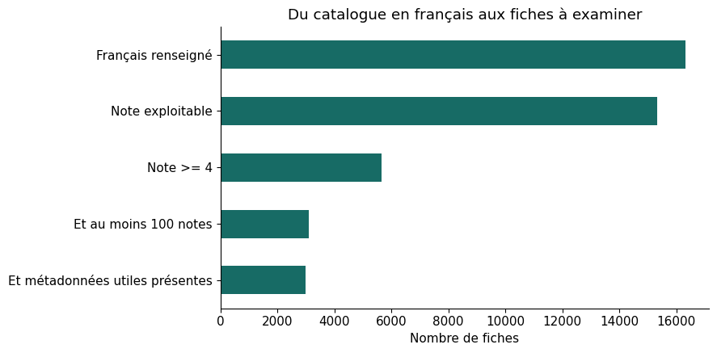
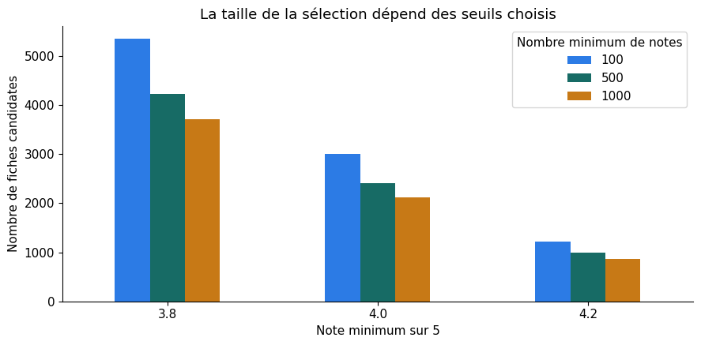

# Goodreads — Du contrôle qualité à une sélection éditoriale

**Projet personnel de Data Analyst junior — Python, Pandas et Power BI.**

Comment préparer une page de découverte de livres en français à partir d'un catalogue Goodreads imparfait ? Pour la librairie fictive **Lire & Choisir**, j'ai contrôlé les données, étudié les segments puis construit une liste de **20 fiches à vérifier** avant un éventuel test.

L'étude utilise les **23 fichiers de livres** du [dataset Kaggle de Bahram Jannesar](https://www.kaggle.com/datasets/bahramjannesarr/goodreads-book-datasets-10m), **version 18, décembre 2020**. Les résultats proviennent des données réelles du dataset. Le grain est une **fiche Goodreads**, qui peut correspondre à une édition ; ce n'est ni une vente ni nécessairement une œuvre unique.

## Ce que j'ai trouvé

- **1 850 032 fiches conservées** sur 1 850 310 lignes : 112 répétitions retirées et 166 versions contradictoires isolées.
- **86,40 % de langues absentes** et seulement **5 notations en médiane** par fiche : la qualité et le volume de notes doivent guider la lecture des scores.
- **16 327 fiches explicitement en français**, dont **3 002 candidates**, puis **2 716 groupes titre/auteur** après rapprochement textuel. La liste de 20 demande encore une vérification des éditions, des séries et de la disponibilité.



*Figure extraite du notebook d'analyse approfondie. Les seuils sont des choix de travail, pas une garantie de ventes.*

## Parcours du projet

| Étape | Livrable | Ce qu'on y trouve |
|---|---|---|
| 1. Poser le problème | [Sujet](subject.txt) et [cadrage](docs/Cadrage.md) | Décision, périmètre, acteurs, questions et limites |
| 2. Définir les mesures | [Dictionnaire et KPI](docs/Dictionnaire.md) | Grain, dénominateurs et règles de sélection |
| 3. Contrôler les données | [Notebook qualité](notebooks/01_data_quality.ipynb) et [rapport qualité](docs/Qualité.md) | Doublons, conflits, manquants, bornes, distributions de notes |
| 4. Comprendre le catalogue | [Analyse globale](notebooks/02_analyse_globale.ipynb) | Langues, volume de notes, pagination et années renseignées |
| 5. Approfondir | [Analyse ciblée](notebooks/03_analyse_approfondie.ipynb) et [synthèse](docs/Analyse.md) | Périmètre français, critères, sensibilité et liste de travail |
| 6. Restituer | [Projet Power BI](powerbi/Goodreads.pbip) et [guide](powerbi/LISEZ_MOI.txt) | Trois pages : catalogue, sélection en français et qualité |

Les notebooks sont enregistrés **avec leurs résultats et graphiques** pour être lisibles sans relancer le traitement. Le code reste volontairement simple : filtres, regroupements, jointure contrôlée et exports CSV.

Les contrôles GitHub Actions vérifient les fichiers versionnés : syntaxe Python, notebooks exécutés sans erreur enregistrée, liens locaux et références des champs Power BI. Ils ne téléchargent pas le catalogue et ne remplacent pas l'exécution complète de l'analyse. Pour les lancer localement : `python scripts/verifier_livrables.py`.

## Pourquoi ne pas simplement trier les notes ?

**79 824 fiches notées 5/5 ont moins de 100 notations.** La langue est souvent absente et plusieurs fiches peuvent décrire des éditions d'un même titre. Je combine donc la note, son volume et des métadonnées utilisables, puis je rapproche les titres et auteurs.

Le seuil de 100 notes reste discutable : à note ≥ 4, passer à 500 notes réduit les candidats de 3 002 à 2 409. Cinq fiches du premier top 20 seraient concernées. Je présente cette sensibilité et les limites au décideur au lieu d'annoncer une sélection optimale.



## Reproduire l'analyse

Exécution vérifiée sous **Windows avec Python 3.10.9** et les versions de [requirements.txt](requirements.txt). Power BI Desktop est nécessaire pour ouvrir le rapport ; aucune licence Office n'est nécessaire pour les notebooks.

Les CSV bruts représentent environ **1,17 Go**, et les exports environ **1,14 Go**. Prévoir plusieurs Go libres, en plus de l'environnement Python. Les notebooks chargent le catalogue en mémoire ; la durée dépend de la machine. La dernière exécution complète a pris environ quatre minutes sur la machine de préparation.

Depuis la racine du dépôt, dans PowerShell :

```powershell
python -m venv .venv
.\.venv\Scripts\python.exe -m pip install -r requirements.txt
.\.venv\Scripts\python.exe -m ipykernel install --sys-prefix --name python3 --display-name "Python (Goodreads)"
.\.venv\Scripts\python.exe scripts/telecharger_donnees.py
.\.venv\Scripts\python.exe main.py
.\.venv\Scripts\python.exe scripts/verifier_exports.py
```

Le téléchargement vise la **version 18**, vérifie chaque empreinte du [manifeste](data/sources.json) et réutilise les fichiers déjà présents si leur empreinte correspond. Si Kaggle demande une connexion ou bloque l'accès automatisé, télécharger cette version depuis la page du dataset et placer les 23 `book*.csv` dans `data/raw/kaggle_v18`, puis relancer le script de vérification du téléchargement.

`main.py` exécute les trois notebooks dans l'ordre et enregistre leurs résultats. Pour les parcourir à la main :

```powershell
.\.venv\Scripts\python.exe -m jupyter lab
```

Choisir le noyau **Python (Goodreads)**, puis exécuter qualité → globale → approfondie. Les [données et exports](data/README.md) sont décrits séparément.

## Ouvrir Power BI

Après génération des CSV, ouvrir [Goodreads.pbip](powerbi/Goodreads.pbip). Les deux dossiers voisins font partie du projet et doivent rester ensemble. Le rapport utilise un modèle à trois tables, une relation à sens unique et **33 mesures DAX**.

Sur un autre ordinateur, modifier le paramètre Power Query `DossierDonnees` vers le dossier `data/processed`, puis actualiser. Le chemin local de préparation est documenté dans le [guide](powerbi/LISEZ_MOI.txt).

| Page | Usage |
|---|---|
| Comprendre le catalogue | Lire les KPI, les langues et les volumes de notes |
| Sélection en français | Examiner les candidats et les 20 fiches proposées |
| Qualité des données | Lire les défauts du périmètre filtré et le bilan fixe de l'import |

Les filtres réduisent la liste proposée sans recalculer le top 20. Les marqueurs de sélection sont calculés sur le catalogue complet. Les compteurs d'import restent fixes et les taux de qualité du catalogue suivent les filtres.

**Validation effectuée :** trois notebooks exécutés sans erreur ; rapprochement des exports ; contrôles des clés, des KPI et des critères ; 57 fichiers Power BI validés avec les schémas Microsoft ; références des champs et positions des visuels contrôlées. Les trois tables ont ensuite été **actualisées dans le moteur de Power BI Desktop**. Les **33 mesures DAX ont été comparées à Pandas dans six contextes**, soit 198 comparaisons concordantes. La liste de 20 et les neuf groupes de langues concordent aussi. Les [résultats de contrôle](powerbi/controle_resultats.json) sont conservés avec le projet.

**Validation visuelle à compléter :** les données et les calculs ont été contrôlés dans le moteur de Power BI Desktop ; le rendu des pages et leurs interactions restent à vérifier manuellement dans l'application. Le projet est fourni au format source PBIP sans cache de données versionné. Les images de ce README sont issues des notebooks.

## Limites et recommandation

Cette photographie de 2020 n'est pas représentative du marché actuel. Il n'y a ni ventes, ni stock, ni prix, ni historique daté des notations dans les fichiers étudiés. Les genres ne sont pas fournis dans ce périmètre. Les compteurs d'éditions ne sont pas additionnés pour annoncer des lecteurs uniques.

Je recommande une **relecture des 20 fiches**, une vérification dans le catalogue commercial, puis un petit test de mise en avant. La disponibilité et la diversité de la liste sont des garde-fous. Aucun gain commercial ni effet causal n'est revendiqué.

## Organisation et versionnement

```text
Goodreads_ETL/
├── subject.txt
├── README.md
├── main.py
├── requirements.txt
├── docs/                 # Cadrage, dictionnaire, qualité, analyse, figures
├── notebooks/            # Trois notebooks exécutés
├── scripts/              # Téléchargement et vérification des exports
├── data/
│   ├── sources.json      # Version, URLs, tailles et empreintes
│   ├── raw/              # Fichiers source, exclus de Git
│   └── processed/        # CSV régénérables, exclus de Git
└── powerbi/              # PBIP, rapport PBIR, modèle et requêtes de contrôle
```

Les fichiers volumineux, les caches locaux Power BI et les environnements Python sont exclus de Git. Les résultats des notebooks, les documents et les définitions du rapport sont versionnés.

### Évolution du projet

Cette version prolonge le travail sur la qualité des données avec une étude métier complète sur les fichiers Kaggle : cadrage, analyse descriptive, sélection argumentée et restitution Power BI. Le [pipeline ETL précédent et sa démo synthétique](https://github.com/juleescourne/goodreads-analytics-etl/tree/8f0540dd420b14f6f3e97fa3f511692aa629c089) restent consultables dans l'historique, avec leurs tests et leur documentation. La démo interactive historique du portfolio utilise un jeu fictif distinct de cette analyse.

## Source et licence

Source : [Goodreads Book Datasets With User Rating 2M — Bahram Jannesar](https://www.kaggle.com/datasets/bahramjannesarr/goodreads-book-datasets-10m), version 18, mise à jour le 3 décembre 2020, téléchargée le 1er octobre 2026. Le titre et le slug de la page ne sont pas le décompte des lignes utilisées : les 23 fichiers de livres totalisent 1 850 310 lignes avant contrôle. Les sept fichiers `user_rating*.csv` sont hors périmètre.

Kaggle déclare **CC0: Public Domain** pour ce dataset. Les fichiers bruts ne sont pas redistribués dans le dépôt. Le code du projet reste sous [licence MIT](LICENSE). Le [manifeste](data/sources.json) permet d'identifier précisément les fichiers analysés.
